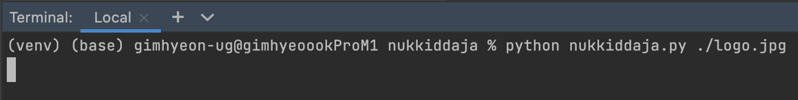

# 누끼따자
누끼따자는 이미지의 흰색 배경을 OpenCV를 활용하여 투명하게 지우는 프로그램입니다.

## 사용법
### 설치
Python 3 인터프리터가 있는 환경에서 아래의 명령을 실행하여
```console
python -m venv ./venv
pip install -r requirements.txt
```
가상환경을 설정하고 OpenCV와 NumPy를 쉽게 설치할 수 있습니다.

### 명령줄에서 사용법
```console
python nukkiddaja.py [배경을 지울 이미지의 경로]
```


## 예시
배경을 삭제하면 아래와 같이 이미지 뷰어가 열려 작업 결과를 미리 확인하실 수 있습니다.


아래는 실제 변환된 이미지입니다.
### 원본

### 작업물

